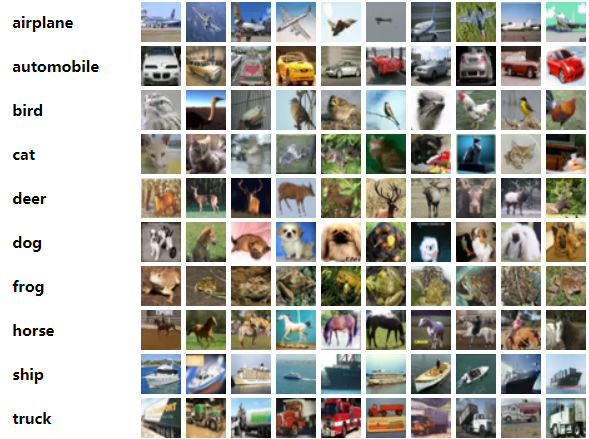

#### 1. cifar-10数据集->[官网](http://www.cs.toronto.edu/~kriz/cifar.html)  
CIFAR-10和CIFAR-100是80 million tiny images数据集的标记子集。它们是由Alex Krizhevsky，Vinod Nair，Geoffrey Hinton收集的。   
CIFAR-10数据集包含10个类、共60000张32x32的彩色图像，每个类包含6000张图像。CIFAR-10有训练图像50000张，测试图像10000张。  
数据集分为五个训练batches和一个测试batch，每个测试batch有10000张图像。测试batch包含每个类的1000个随机选择的图像。训练batches包含随机顺序的剩余图像，但是一些五个训练batches中有的batch可能包含一个类的图像多于另一个类的图像。但五个训练batches总共包含每个类的恰好5000个图像。  
以下是数据集中的类，以及来自每个类的10张随机图像:  

这些类完全是互斥的。汽车和卡车之间没有重叠。“汽车”包括轿车、越野车之类的东西。“卡车”只包括大卡车。小货车也不包括在内。
