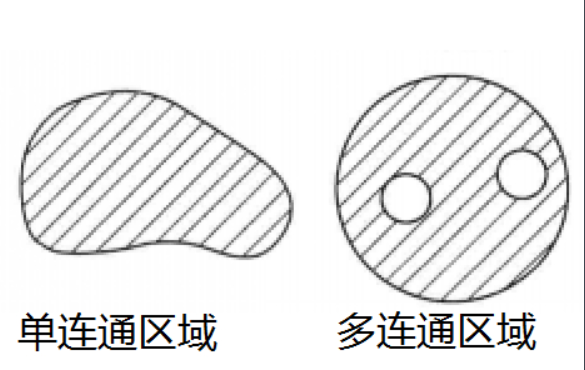

#### 1. Logs  
(1)计算机图形图像处理基础->阅读10.1  
#### 2. 图像分割概述   
图像分割就是将图像划分成若干个有意义的区域，并提取出感兴趣目标的技术。  
并没有准确地判断图像分割是否成功的标准，进行的图像分割工作有利于后续工作实现既定的目标和任务就是“有意义”的。  
图像分割的基本原则是：区域内部**灰度**或**形状**或**纹理**是相同的、相近的；相邻的区域间**灰度**或**形状**或**纹理**是不同的、有差异的。  
图像分割的方法有：基于区域、基于边界、区域生成和边界检测相结合的分割方法。  
- 基于区域生成的分割方法：找出特征相近的像点，生成区域
- 基于边界检测的分割方法：找出图像特征不一致的点，将他们连成边界，这些边界划分出若干个不同的区域
- 区域生成和边界检测相结合的分割方法：特征相近的点生成区域，不相近的点连成边界
- 注：按照分割策略分，可以分为串行方法（抗噪声能力强）和并行方法（计算时间耗费少）    

图像分割的依据属性或特征可以有：像素灰度、小区域的平均灰度、灰度分布、灰度方差、灰度纹理等。  
#### 3. 连通区域
复平面上一个区域G，如果在G中任做一条简单闭合曲线，而曲线的内部总属于G，那么G就是单连通区域。一个区域不是单连通区域，就称为多连通区域。（可以根据是否有**洞**来判断）  

