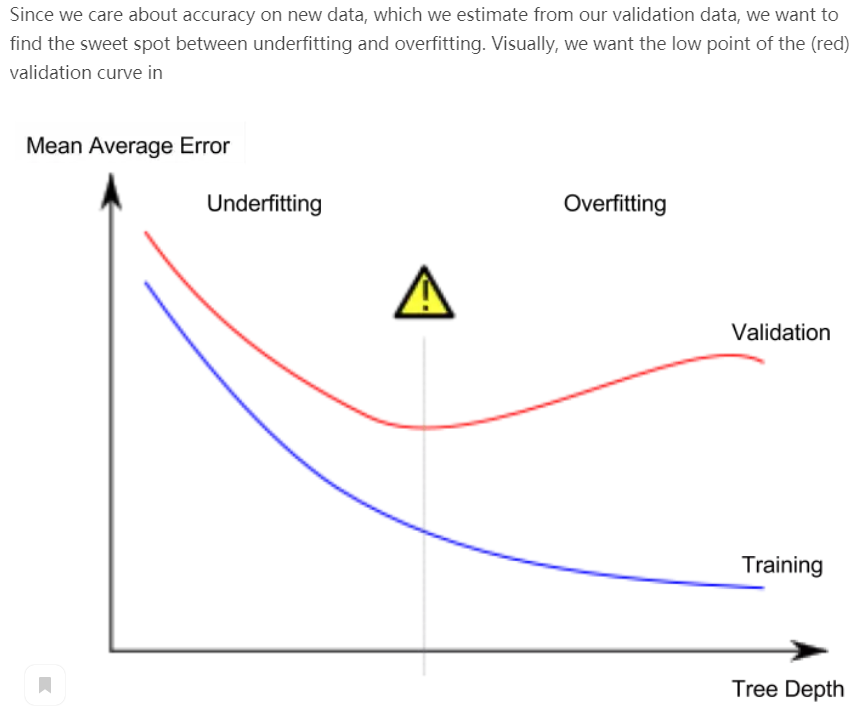

#### 1. Machine Learning Tutorial
1. 一个数据集有很多属性，我们可以依靠知觉选择几个属性用于构建模型，但也有自动选择数据feature的方法
2. 通常用pandas处理csv文件等数据，其对应的数据类型是DataFrame；sklearn库用于创建模型
3. **MAE**，全称Mean Absolute Error：计算每一个预测值与真实值的误差的绝对值，然后取这些误差的平均值
4. **验证数据**：由于模型是从训练数据中衍生出来的，所以该模型在训练数据中会显得更加准确。但是如果模型看到新数据时不适用，那么在实际使用时这个模型就会非常不准确。由于模型的实用价值来自于对新数据的预测，所以我们度量那些没有用于构建模型的数据的性能。最直接的方法是从模型构建过程中排除一些数据，然后使用这些数据来测试模型对以前没有见过的数据的准确性。此数据称为验证数据。
5. 学习用MAE（评价模型好坏的一个量）在验证集上评估模型的好坏之后，需要**挑选模型**测试看看哪种模型在验证集上的表现较好。教程中给出：sklearn库中有许多不同深度的决策数（足够你用了）。
6. 过拟合和欠拟合的理解：过拟合，对训练数据拟合过于精确，导致在验证集上效果差；欠拟合，对训练数据拟合过于粗略，导致在验证集上效果差。我们希望找到一个对训练数据既不敏感又不迟钝的模型，能够使在验证集上的MAE达到最小（对验证集拟合最好），如下图所示：  

7. 随机森林：随机森林使用许多树，它通过对每个组件树的预测取平均值来进行预测。它通常比单个决策树具有更好的预测精度，并且在默认参数下表现良好。  
8. 随机森林VS单个决策树：从MAE来看，随机森林的效果比单个决策树的性能有显著的提升。随机森林也可以通过调整超参数提升效果，就像调整单个决策树的深度以找到最佳模型一样。但是通常没有这种调优，随机森林也可以工作得很好。
